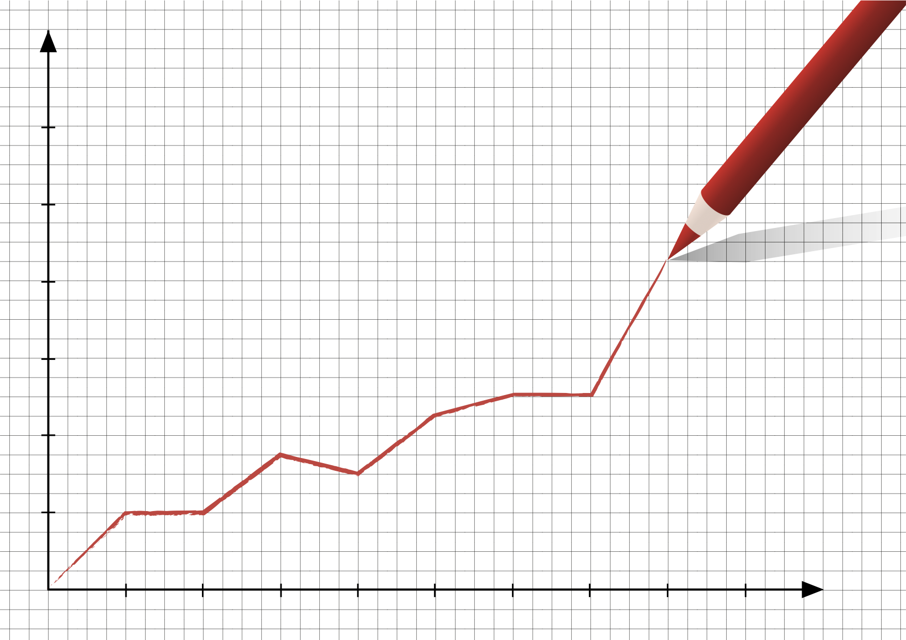

# Project_1

<h2>Compare Gun Laws and Gun Related Crimes in the Southeast Region (FL, GA, SC, AL) in major metro areas over the last 5 years.</h2>

<h3>Data Sources:</h3>

	• Census - population/city sizes

	• Crime - US Gov, State level, or City level

	• State Laws

		○ Categorize states by law type

<h3>Questions:</h3>

	• How do laws affect avg gun crimes?

	• How does population size affect crime rate?

		○ Maybe pull in different city size 

	• Crimes by severity

		○ By state

		○ By city

<h3>Tasks:</h3>

	• Pull Census Data to identify top 4 cities by size

	• State/City Crime data
	
	• Pull state gun laws
	
	• Categorize states by law type
	
	• Analyze crimes by severity & State
	
	• DO SOME WORK
	
	• Graph!
	

		
